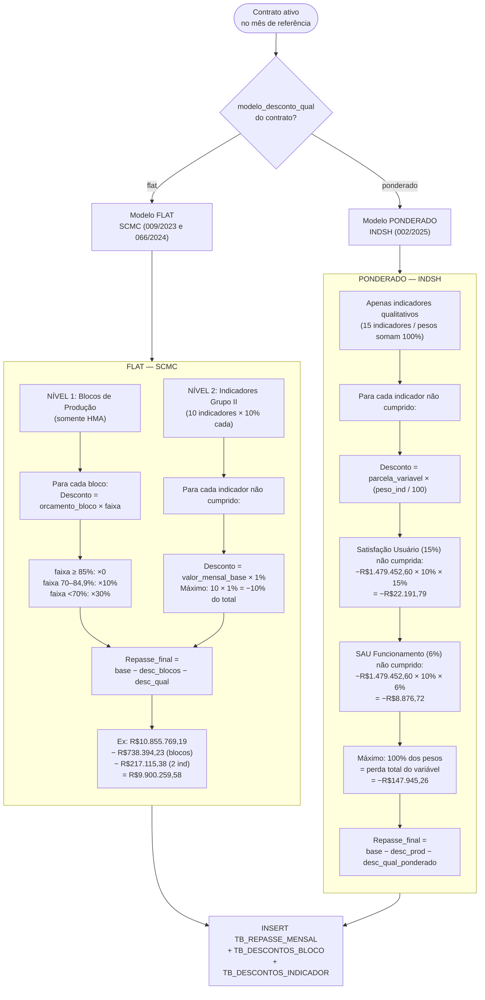
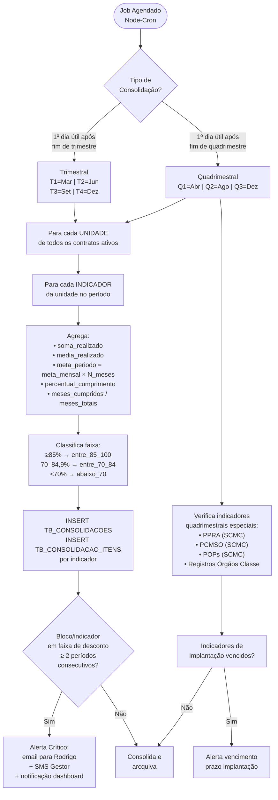
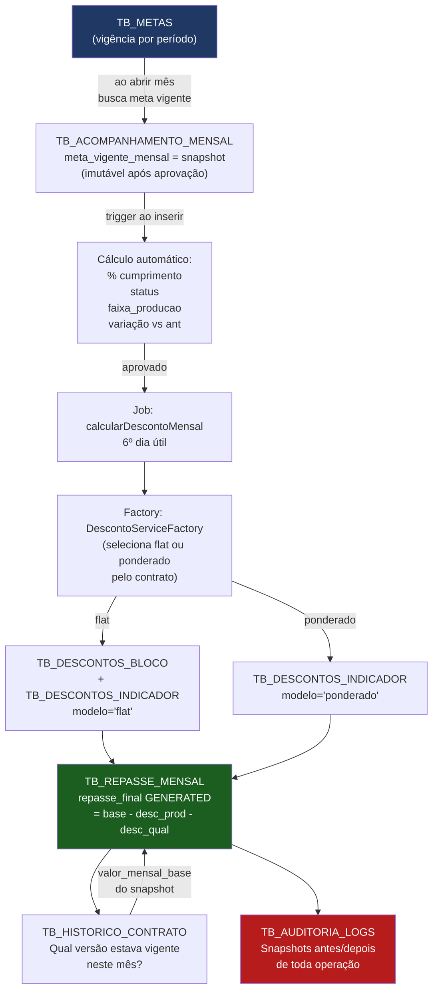

# 📊 ERD E FLUXO DE DADOS — SaúdeControl OSS v2.0
## Sistema de Acompanhamento de Contratos de Gestão em Saúde Pública
### Município de Americana/SP

**Versão:** 2.1 | **Atualizado:** 23 de abril de 2026  
**Responsável:** Rodrigo Alexander Diaz Leon, Diretor de Planejamento da SMS Americana  
**Atualização:** decomposição de metas (pai/filhas), unicidade acomp. por (`meta_id`,`mês`), tabela de permissões por perfil — ver [spec metas](superpowers/specs/2026-04-23-metas-decomposicao-pesos-design.md)

---

## 1. ERD COMPLETO

```mermaid
erDiagram

    %% ─── GRUPO A: ESTRUTURA CONTRATUAL ──────────────────────────

    TB_OSS ||--o{ TB_CONTRATOS          : "1 OSS → N contratos"
    TB_CONTRATOS ||--o{ TB_ADITIVOS     : "1 contrato → N aditivos"
    TB_CONTRATOS ||--o{ TB_HISTORICO_CONTRATO : "1 contrato → N versões"
    TB_ADITIVOS  ||--o{ TB_HISTORICO_CONTRATO : "1 aditivo → 1 versão"
    TB_CONTRATOS ||--o{ TB_UNIDADES     : "1 contrato → N unidades"
    TB_UNIDADES  ||--o{ TB_BLOCOS_PRODUCAO    : "1 unidade → N blocos"
    TB_BLOCOS_PRODUCAO ||--o{ TB_HISTORICO_BLOCOS : "1 bloco → N versões"
    TB_ADITIVOS  ||--o{ TB_HISTORICO_BLOCOS   : "aditivo pode alterar blocos"

    %% ─── GRUPO B: INDICADORES E METAS ───────────────────────────

    TB_UNIDADES   ||--o{ TB_INDICADORES       : "1 unidade → N indicadores"
    TB_BLOCOS_PRODUCAO ||--o{ TB_INDICADORES  : "1 bloco → N indicadores"
    TB_INDICADORES ||--o{ TB_HISTORICO_INDICADORES : "1 ind → N versões"
    TB_ADITIVOS   ||--o{ TB_HISTORICO_INDICADORES  : "aditivo pode alterar ind"
    TB_INDICADORES ||--o{ TB_METAS           : "1 ind → N metas (por vigência)"
    TB_ADITIVOS   ||--o{ TB_METAS            : "aditivo cria nova meta"
    TB_METAS      ||--o{ TB_METAS            : "pai agregada → N componentes"

    %% ─── GRUPO C: ACOMPANHAMENTO ────────────────────────────────

    TB_INDICADORES    ||--o{ TB_ACOMPANHAMENTO_MENSAL : "1 ind → N meses"
    TB_METAS          ||--o{ TB_ACOMPANHAMENTO_MENSAL : "1 meta folha → N meses (UK meta+mês)"
    TB_USUARIOS       ||--o{ TB_ACOMPANHAMENTO_MENSAL : "usuário preenche/aprova"
    TB_ACOMPANHAMENTO_MENSAL ||--o{ TB_NOTAS_EXPLICATIVAS : "desvios → notas"
    TB_UNIDADES       ||--o{ TB_CONSOLIDACOES : "1 unidade → N consolidações"
    TB_CONSOLIDACOES  ||--o{ TB_CONSOLIDACAO_ITENS : "1 consolidação → N itens"
    TB_INDICADORES    ||--o{ TB_CONSOLIDACAO_ITENS : "por indicador"

    %% ─── GRUPO D: DESCONTOS E REPASSE ───────────────────────────

    TB_CONTRATOS         ||--o{ TB_REPASSE_MENSAL    : "1 contrato → N meses"
    TB_HISTORICO_CONTRATO||--o{ TB_REPASSE_MENSAL    : "versão vigente do contrato"
    TB_REPASSE_MENSAL    ||--o{ TB_DESCONTOS_BLOCO   : "repasse → N blocos desc."
    TB_REPASSE_MENSAL    ||--o{ TB_DESCONTOS_INDICADOR : "repasse → N ind desc."
    TB_BLOCOS_PRODUCAO   ||--o{ TB_DESCONTOS_BLOCO   : "bloco → desconto"
    TB_ACOMPANHAMENTO_MENSAL ||--o{ TB_DESCONTOS_INDICADOR : "acomp → desconto"
    TB_INDICADORES       ||--o{ TB_DESCONTOS_INDICADOR : "indicador → desconto"

    %% ─── GRUPO E: RUBRICAS ORÇAMENTÁRIAS ────────────────────────

    TB_CONTRATOS ||--o{ TB_RUBRICAS         : "1 contrato → N rubricas"
    TB_RUBRICAS  ||--o{ TB_RUBRICAS         : "grupo → sub-itens (auto-ref)"
    TB_RUBRICAS  ||--o{ TB_EXECUCAO_FINANCEIRA : "rubrica → execução mensal"
    TB_RUBRICAS  ||--o{ TB_HISTORICO_RUBRICAS  : "rubrica → N versões"
    TB_ADITIVOS  ||--o{ TB_HISTORICO_RUBRICAS  : "aditivo pode alterar rubrica"

    %% ─── GRUPO F: OPERACIONAL ────────────────────────────────────

    TB_UNIDADES  ||--o{ TB_COMISSOES                : "unidade → comissões"
    TB_UNIDADES  ||--o{ TB_DOCUMENTOS_REGULATORIOS  : "unidade → documentos"

    %% ─── GRUPO G: SEGURANÇA ──────────────────────────────────────

    TB_OSS       ||--o{ TB_USUARIOS      : "OSS → usuários restritos"
    TB_USUARIOS  ||--o{ TB_AUDITORIA_LOGS : "usuário → logs"

    %% ─── ENTIDADES ───────────────────────────────────────────────

    TB_OSS {
        CHAR36  oss_id           PK
        VARCHAR nome             "SCMC – Grupo Chavantes | INDSH"
        CHAR18  cnpj             UK "73.027.690/0001-46"
        ENUM    tipo_org
        VARCHAR email
        VARCHAR telefone
        TEXT    endereco_social
        TEXT    endereco_adm
        TINYINT ativa
        DATETIME deleted_at      "soft-delete LGPD"
        DATETIME criado_em
        DATETIME atualizado_em
    }

    TB_CONTRATOS {
        CHAR36  contrato_id      PK
        CHAR36  oss_id           FK
        VARCHAR numero           "009/2023 | 066/2024 | 002/2025"
        ENUM    tipo             "contrato_gestao | chamamento_publico"
        DATE    data_inicio
        DATE    data_fim
        DEC1502 valor_mensal_base "10.855.769,19 | 1.600.982,91 | 1.479.452,60"
        DEC1502 valor_anual      "GENERATED = base x 12"
        DEC0502 perc_fixo        "90.00"
        DEC0502 perc_variavel    "10.00"
        ENUM    modelo_desconto_qual "flat | ponderado"
        INT     numero_aditivos
        ENUM    status           "Ativo | Encerrado | Suspenso | Rompido"
        DATETIME deleted_at
        DATETIME criado_em
        DATETIME atualizado_em
    }

    TB_HISTORICO_CONTRATO {
        CHAR36  historico_id     PK
        CHAR36  contrato_id      FK
        CHAR36  aditivo_id       FK "NULL = versão original"
        INT     versao           "1 2 3..."
        DATE    vigencia_inicio
        DATE    vigencia_fim     "NULL = vigente"
        DEC1502 valor_mensal_base
        DEC0502 perc_fixo
        DEC0502 perc_variavel
        ENUM    modelo_desconto_qual
        TEXT    motivo_versao    "Versão original | Reajuste IPCA | 2 TA"
        CHAR36  aprovado_por     FK
        DATETIME criado_em
    }

    TB_ADITIVOS {
        CHAR36  aditivo_id       PK
        CHAR36  contrato_id      FK
        INT     numero_aditivo   "1 2 3..."
        DATE    data_assinatura
        DATE    data_vigencia_inicio
        ENUM    tipo_aditivo     "prorrogacao | reajuste | alteracao_metas | misto"
        VARCHAR descricao_sumaria
        LONGTEXT conteudo_completo
        VARCHAR documento_url
        DEC1502 valor_anterior   "snapshot antes"
        DEC1502 novo_valor_mensal "NULL se sem mudança financeira"
        DATE    nova_data_fim
        DEC0604 ipca_aplicado    "0.0468 = 4,68%"
        TINYINT aplicado
        DATETIME aplicado_em
        CHAR36  aprovado_por     FK
        DATETIME criado_em
    }

    TB_UNIDADES {
        CHAR36  unidade_id       PK
        CHAR36  contrato_id      FK
        VARCHAR nome             "Hospital Municipal Dr. Waldemar Tebaldi"
        VARCHAR sigla            "HMA | UPA_CILLOS | UPA_DONA_ROSA | UPA_ZANAGA"
        ENUM    tipo             "hospital | upa | unacon | pa"
        VARCHAR cnes             "7471777 | 4777220"
        TEXT    endereco
        VARCHAR porte            "Porte Médio II | UPA Porte II Opção V"
        INT     capacidade_leitos "128 HMA | NULL UPAs"
        JSON    especialidades   "Clínico Geral Emergência Pediatria"
        DEC1502 valor_mensal_unidade
        DEC0502 percentual_peso
        TINYINT ativa
        DATETIME deleted_at
        DATETIME criado_em
        DATETIME atualizado_em
    }

    TB_BLOCOS_PRODUCAO {
        CHAR36  bloco_id         PK
        CHAR36  unidade_id       FK
        VARCHAR codigo           "BLOCO_URG | BLOCO_INT | BLOCO_SADT | BLOCO_CIR"
        VARCHAR nome             "Bloco 1 – Urgência/Emergência"
        DEC1502 valor_mensal_alocado
        DEC0502 percentual_peso_bloco
        TINYINT ativo
        DATETIME criado_em
        DATETIME atualizado_em
    }

    TB_HISTORICO_BLOCOS {
        CHAR36  hist_bloco_id    PK
        CHAR36  bloco_id         FK
        CHAR36  aditivo_id       FK "NULL = original"
        INT     versao
        DATE    vigencia_inicio
        DATE    vigencia_fim
        DEC1502 valor_mensal_alocado
        DEC0502 percentual_peso_bloco
        TEXT    motivo_versao
        DATETIME criado_em
    }

    TB_INDICADORES {
        CHAR36  indicador_id     PK
        CHAR36  unidade_id       FK "NULL = transversal"
        CHAR36  bloco_id         FK "NULL = não vinculado a bloco"
        VARCHAR codigo           UK "HMA_QUAL_01 | ZANAGA_SAU_FUNC"
        VARCHAR nome
        ENUM    tipo             "quantitativo | qualitativo"
        ENUM    grupo            "auditoria_operacional | qualidade_atencao"
        TEXT    formula_calculo
        VARCHAR unidade_medida   "atendimentos | % | dias | sessões"
        ENUM    periodicidade    "mensal | bimestral | trimestral | quadrimestral | unico"
        TINYINT tipo_implantacao "1 = prazo único ex-INDSH"
        INT     prazo_dias_impl  "60 | 90 dias"
        ENUM    fonte_dados      "SIASUS | SIH | CNES | Manual"
        DEC0502 peso_perc        "Para modelo ponderado INDSH"
        ENUM    meta_tipo        "maior_igual | menor_igual | percentual_max"
        INT     versao
        TINYINT ativo
        DATETIME deleted_at
        DATETIME criado_em
        DATETIME atualizado_em
    }

    TB_HISTORICO_INDICADORES {
        CHAR36  hist_ind_id      PK
        CHAR36  indicador_id     FK
        CHAR36  aditivo_id       FK
        INT     versao
        DATE    vigencia_inicio
        DATE    vigencia_fim
        VARCHAR nome
        TEXT    formula_calculo
        VARCHAR periodicidade
        DEC0502 peso_perc
        VARCHAR meta_tipo
        TEXT    motivo_versao
        CHAR36  alterado_por     FK
        DATETIME criado_em
    }

    TB_METAS {
        CHAR36  meta_id          PK
        CHAR36  indicador_id     FK
        CHAR36  parent_meta_id   FK "NULL = raiz; filho = componente"
        ENUM    papel "avulsa | agregada | componente"
        DEC104  peso "NULL ou >0 se componente"
        CHAR36  aditivo_id       FK "NULL = meta original"
        INT     versao
        DATE    vigencia_inicio
        DATE    vigencia_fim     "NULL = vigente"
        DEC154  meta_mensal      "12.000 atend | NULL para qualitativos"
        DEC154  meta_anual       "144.000 | calculado"
        DEC154  meta_valor_qualit "0.85 = 85% | 10 = 10 dias"
        DEC154  meta_minima      "70% da meta = faixa desconto 30%"
        DEC154  meta_parcial     "85% da meta = sem desconto"
        VARCHAR unidade_medida
        TEXT    observacoes      "Incremento base histórica 2025 → 1.450 RX"
        DATE    prazo_implantacao
        CHAR36  aprovado_por     FK
        DATETIME criado_em
        DATETIME atualizado_em
    }

    TB_ACOMPANHAMENTO_MENSAL {
        CHAR36  acomp_id         PK
        CHAR36  indicador_id     FK
        CHAR36  meta_id          FK "folha: avulsa ou componente; UK (meta_id, mês)"
        DATE    mes_referencia   "YYYY-MM-01"
        DEC154  meta_vigente_mensal "snapshot da meta"
        DEC154  meta_vigente_qualit "snapshot meta qualitativa"
        DEC154  valor_realizado  ">=0 | NULL em rascunho"
        DEC0804 percentual_cumprimento "GENERATED = realiz/meta x100"
        DEC0804 variacao_vs_mes_ant "calculado por trigger"
        ENUM    status_cumprimento "cumprido | parcial | nao_cumprido | aguardando"
        ENUM    faixa_producao   "acima_meta | entre_85_100 | entre_70_84 | abaixo_70"
        ENUM    status_implantacao "nao_iniciado | em_prazo | cumprido | vencido"
        DATE    data_cumprimento_impl
        TEXT    descricao_desvios "obrigatório quando não cumprido"
        ENUM    status_aprovacao  "rascunho | submetido | aprovado | rejeitado"
        CHAR36  preenchido_por   FK
        DATETIME data_preenchimento
        CHAR36  aprovado_por     FK
        DATETIME data_aprovacao
        DEC1502 desconto_estimado "em tempo real"
        INT     versao
        DATETIME criado_em
        DATETIME atualizado_em
    }

    TB_NOTAS_EXPLICATIVAS {
        CHAR36  nota_id          PK
        CHAR36  acomp_id         FK
        TEXT    descricao        "obrigatória"
        TEXT    causa_raiz
        TEXT    acao_corretiva
        DATE    previsao_normalizacao
        CHAR36  criado_por       FK
        CHAR36  validado_por     FK
        ENUM    status_validacao "pendente | aceita | rejeitada"
        DATETIME criado_em
        DATETIME atualizado_em
    }

    TB_CONSOLIDACOES {
        CHAR36  consolidacao_id  PK
        CHAR36  unidade_id       FK
        ENUM    tipo_periodo     "trimestral | quadrimestral"
        TINYINT periodo_numero   "T1-T4 | Q1-Q3"
        SMALLINT ano
        DATE    data_inicio
        DATE    data_fim
        ENUM    status           "gerado | validado | arquivado"
        DATETIME gerado_em
    }

    TB_CONSOLIDACAO_ITENS {
        CHAR36  item_id          PK
        CHAR36  consolidacao_id  FK
        CHAR36  indicador_id     FK
        DEC154  soma_realizado
        DEC154  media_realizado
        DEC154  meta_periodo
        DEC0804 percentual_cumprimento
        ENUM    faixa            "acima_meta | entre_85_100 | entre_70_84 | abaixo_70"
        TINYINT meses_cumpridos
        TINYINT meses_totais
        DEC1502 desconto_periodo
        DATETIME criado_em
    }

    TB_REPASSE_MENSAL {
        CHAR36  repasse_id       PK
        CHAR36  contrato_id      FK
        CHAR36  historico_contrato_id FK "versão vigente"
        DATE    mes_referencia
        DEC1502 valor_mensal_base
        DEC1502 parcela_fixa
        DEC1502 parcela_variavel
        DEC1502 desconto_producao_total
        DEC1502 desconto_qualidade_total
        DEC1502 desconto_total   "GENERATED = prod + qual"
        DEC1502 repasse_final    "GENERATED = base - descontos"
        DEC0502 percentual_retido "GENERATED"
        ENUM    status           "calculado | validado | aprovado | pago"
        CHAR36  aprovado_por     FK
        DATETIME data_pagamento
        DATETIME criado_em
        DATETIME atualizado_em
    }

    TB_DESCONTOS_BLOCO {
        CHAR36  desc_bloco_id    PK
        CHAR36  repasse_id       FK
        CHAR36  bloco_id         FK
        DATE    mes_referencia
        DEC154  meta_mensal
        DEC154  valor_realizado
        DEC0804 percentual_atingimento
        ENUM    faixa
        DEC1502 orcamento_bloco
        DEC0502 percentual_desconto "0 | 10 | 30"
        DEC1502 valor_desconto
        TINYINT auditado
        CHAR36  auditado_por     FK
        DATETIME criado_em
    }

    TB_DESCONTOS_INDICADOR {
        CHAR36  desc_ind_id      PK
        CHAR36  repasse_id       FK
        CHAR36  acomp_id         FK
        CHAR36  indicador_id     FK
        DATE    mes_referencia
        ENUM    modelo_desconto  "flat | ponderado"
        DEC0502 peso_indicador   "para modelo ponderado"
        DEC0502 percentual_desconto "1% flat | peso% ponderado"
        DEC1502 valor_desconto
        TINYINT auditado
        CHAR36  auditado_por     FK
        DATETIME criado_em
    }

    TB_RUBRICAS {
        CHAR36  rubrica_id       PK
        CHAR36  contrato_id      FK
        CHAR36  rubrica_pai_id   FK "auto-referência para sub-itens"
        VARCHAR codigo           "01 | 01.17"
        VARCHAR nome             "Recursos Humanos | Salários"
        ENUM    nivel            "grupo | categoria"
        TINYINT ativo
        DATETIME criado_em
    }

    TB_EXECUCAO_FINANCEIRA {
        CHAR36  exec_id          PK
        CHAR36  rubrica_id       FK
        DATE    mes_referencia
        DEC1502 valor_orcado     "conforme planilha aprovada"
        DEC1502 valor_realizado  "até 20 dia útil"
        DEC1502 variacao         "GENERATED = real - orcado"
        DEC0804 variacao_perc    "GENERATED %"
        ENUM    status_aprovacao "rascunho | submetido | aprovado"
        CHAR36  preenchido_por   FK
        CHAR36  aprovado_por     FK
        DATETIME criado_em
        DATETIME atualizado_em
    }

    TB_HISTORICO_RUBRICAS {
        CHAR36  hist_rub_id      PK
        CHAR36  rubrica_id       FK
        CHAR36  aditivo_id       FK
        INT     versao
        DATE    vigencia_inicio
        DATE    vigencia_fim
        DEC1502 valor_orcado_mensal
        TEXT    motivo_versao
        DATETIME criado_em
    }

    TB_COMISSOES {
        CHAR36  comissao_id      PK
        CHAR36  unidade_id       FK
        ENUM    tipo             "CCIH | SAU | CIPA | NSP | Obitos | Prontuarios | Etica"
        DATE    data_constituicao
        TINYINT funcionando
        DATE    ultima_reuniao
        JSON    integrantes
        DATETIME criado_em
        DATETIME atualizado_em
    }

    TB_DOCUMENTOS_REGULATORIOS {
        CHAR36  doc_id           PK
        CHAR36  unidade_id       FK
        ENUM    tipo_documento   "CNES | Alvara_Sanitario | AVCB | Habilitacao_UNACON"
        VARCHAR numero_documento
        VARCHAR orgao_emissor
        DATE    data_emissao
        DATE    data_vencimento  "NULL = sem prazo"
        TINYINT ativa
        VARCHAR arquivo_url
        DATETIME criado_em
        DATETIME atualizado_em
    }

    TB_USUARIOS {
        CHAR36  usuario_id       PK
        VARCHAR nome
        VARCHAR email            UK
        CHAR14  cpf              UK
        ENUM    perfil           "admin | gestor_sms | auditora | contratada_scmc | contratada_indsh"
        CHAR36  oss_id           FK "NULL = acesso a todas"
        VARCHAR senha_hash       "bcrypt 12+ rounds"
        TINYINT ativo
        DATETIME data_criacao
        DATETIME ultimo_acesso
        DATETIME deleted_at      "soft-delete LGPD"
        DATETIME atualizado_em
    }

    TB_AUDITORIA_LOGS {
        CHAR36  log_id           PK
        CHAR36  usuario_id       FK "NULL = job automático"
        VARCHAR tabela_afetada
        CHAR36  registro_id
        ENUM    operacao         "INSERT | UPDATE | DELETE | SELECT | LOGIN | APPROVE"
        JSON    dados_antes      "snapshot anterior"
        JSON    dados_depois     "snapshot novo"
        VARCHAR ip_origem
        TEXT    user_agent
        DATETIME data_operacao
        TEXT    descricao_mudanca
    }

    TB_PERMISSOES_PERFIL {
        CHAR36  perm_id         PK
        ENUM    perfil         "chave lógica com modulo"
        VARCHAR modulo
        TINYINT can_view
        TINYINT can_insert
        TINYINT can_update
        TINYINT can_delete
        ENUM    escopo         "global | proprio"
    }
```

*Nota: `TB_PERMISSOES_PERFIL` não possui FK para `TB_USUARIOS` — o vínculo é pelo valor textual do `perfil` iguais ao enum do usuário; preenchida por seeder e mantida via API administrativa.*

---

## 2. FLUXO PRINCIPAL: CICLO MENSAL COMPLETO

```mermaid
flowchart TD
    START(["Início do Mês"]) --> F1

    subgraph F1 ["1º–5º Dia Útil — Coleta de Dados"]
        direction TB
        A1["Gestor SMS\nfaz login"] --> A2["Seleciona contrato\ne mês"]
        A2 --> A3["Carrega indicadores\ncom metas vigentes\n(VW_META_VIGENTE)"]
        A3 --> A4["Preenche valor_realizado\npara cada indicador"]
        A4 --> A5{"Validação\nautomática"}
        A5 -->|"valor < 0\nou formato inválido"| A4
        A5 -->|OK| A6["Trigger calcula:\n% cumprimento\nfaixa\nvariação vs ant"]
        A6 --> A7["Salva como RASCUNHO\nem TB_ACOMPANHAMENTO_MENSAL"]
        A7 --> A8{"Desconto\n< 85%?"}
        A8 -->|Sim| A9["Exige\nTB_NOTAS_EXPLICATIVAS\n(nota obrigatória)"]
        A8 -->|Não| A10
        A9 --> A10["Gestor submete\npara auditoria"]
        A10 --> A11["Registra em\nTB_AUDITORIA_LOGS\n(INSERT)"]
        A11 --> A12["Status: SUBMETIDO\nAguarda auditora"]
    end

    F1 --> F2

    subgraph F2 ["6º Dia Útil — Cálculo Automático (Job)"]
        direction TB
        B1["Job: calcularDescontoMensal\n(Node-Cron 06º dia útil 02h)"] --> B2
        B2["Para cada CONTRATO\nativo no mês"] --> B3
        B3["Busca TB_HISTORICO_CONTRATO\nversão vigente no mês"] --> B4

        subgraph SCMC ["Modelo FLAT (SCMC)"]
            C1["Por BLOCO de Produção\n(HMA: 4 blocos)"] --> C2
            C2{"% Realizado\nvs Meta"} -->|"≥ 85%"| C3["Desconto = 0%"]
            C2 -->|"70–84,9%"| C4["Desconto = 10%\ndo orçamento do bloco"]
            C2 -->|"< 70%"| C5["Desconto = 30%\ndo orçamento do bloco"]
            C3 & C4 & C5 --> C6["INSERT\nTB_DESCONTOS_BLOCO"]
            C6 --> C7["Por INDICADOR\nGrupo Qualidade (Grupo II)"]
            C7 --> C8{"Cumprido?"}
            C8 -->|Não| C9["Desconto = −1%\ndo total do contrato"]
            C8 -->|Sim| C10["Desconto = 0%"]
            C9 & C10 --> C11["INSERT\nTB_DESCONTOS_INDICADOR\nmodelo='flat'"]
        end

        subgraph INDSH ["Modelo PONDERADO (INDSH)"]
            D1["Por INDICADOR\n(15 indicadores / 100%)"] --> D2{"Cumprido?"}
            D2 -->|Não| D3["Desconto = peso_perc%\ndo variável\nex: 15% × R$147.945"]
            D2 -->|Sim| D4["Desconto = 0%"]
            D3 & D4 --> D5["INSERT\nTB_DESCONTOS_INDICADOR\nmodelo='ponderado'"]
        end

        B4 --> SCMC & INDSH
        C11 & D5 --> B5["INSERT\nTB_REPASSE_MENSAL\n(GENERATED: repasse_final)"]
        B5 --> B6["Envia alertas\npor email/dashboard\nGestor + Auditora + Rodrigo"]
        B6 --> B7["Registra em\nTB_AUDITORIA_LOGS"]
    end

    F2 --> F3

    subgraph F3 ["7º–10º Dia Útil — Auditoria"]
        direction TB
        E1["Auditora acessa\nfila de aprovação"] --> E2
        E2["Visualiza TB_REPASSE_MENSAL\n+ TB_DESCONTOS_BLOCO\n+ TB_DESCONTOS_INDICADOR\npor contrato"] --> E3
        E3["Verifica TB_NOTAS_EXPLICATIVAS\npara cada desvio"] --> E4
        E4{"Validação\nOK?"}
        E4 -->|"Rejeitar indicador"| E5["UPDATE status_aprovacao='rejeitado'\nNotifica gestor\nRegistra em AUDITORIA_LOGS"]
        E5 --> E1
        E4 -->|"Aprovar todos"| E6["UPDATE TB_DESCONTOS_BLOCO\nauditado = 1"]
        E6 --> E7["UPDATE TB_DESCONTOS_INDICADOR\nauditado = 1"]
        E7 --> E8["UPDATE TB_REPASSE_MENSAL\nstatus = 'validado'"]
        E8 --> E9["Gera parecer técnico\npor contrato"]
        E9 --> E10["INSERT TB_AUDITORIA_LOGS\noperacao='APPROVE'"]
    end

    F3 --> F4

    subgraph F4 ["11º–14º Dia Útil — Aprovação Final"]
        direction TB
        G1["Rodrigo/Gestor SMS\naprova repasse"] --> G2
        G2["UPDATE TB_REPASSE_MENSAL\nstatus = 'aprovado'"] --> G3
        G3["Sistema calcula totais\npor OSS:\nSCMC = soma 009+066\nINDSH = 002/2025"] --> G4
        G4["Exporta planilha\nde pagamento por OSS"] --> G5
        G5["INSERT TB_AUDITORIA_LOGS\noperacao='EXPORT'"]
    end

    F4 --> F5

    subgraph F5 ["15º Dia Útil — Repasse"]
        direction TB
        H1["Transferência bancária\npor OSS"] --> H2
        H2["UPDATE TB_REPASSE_MENSAL\nstatus = 'pago'\ndata_pagamento = NOW()"] --> H3
        H3["Notificação enviada\npara SCMC e INDSH"]
    end

    F5 --> F6

    subgraph F6 ["16º–30º Dias — Consolidação e Relatórios"]
        direction TB
        I1["Job: consolidacaoTrimestral\n(se fim de trimestre)"] --> I2
        I1b["Job: consolidacaoQuadrimestral\n(se fim de quadrimestre)"] --> I2
        I2["INSERT TB_CONSOLIDACOES\n+ TB_CONSOLIDACAO_ITENS\npor unidade"] --> I3
        I3["Rodrigo gera\nPauta CMS"] --> I4
        I4["Consulta:\nAcompanhamento + Descontos\n+ Metas + Rubricas\n+ Consolidações"] --> I5
        I5["Gera PDF\ncom resumo de todas\nas unidades e contratos"] --> I6
        I6["CMS delibera\nbased em dados"]
    end

    F6 --> END(["Fim do Ciclo\nInício do próximo mês"])
```



---

## 3. FLUXO DE VERSIONAMENTO: COMO FUNCIONA O ADITIVO

```mermaid
flowchart LR
    AT(["Aditivo\nasssinado"]) --> AD

    subgraph AD ["TB_ADITIVOS"]
        ad1["INSERT\nnumero_aditivo = N+1\ntipo_aditivo = 'reajuste_financeiro'\nnovo_valor_mensal = R$1.650.000\nipca_aplicado = 0.0468"]
    end

    AD --> SP["CALL sp_aplicar_aditivo(aditivo_id)"]

    subgraph HIST ["Cria Snapshots Históricos"]
        direction TB
        h1["TB_HISTORICO_CONTRATO:\nFecha versão anterior\nvigencia_fim = hoje-1\n---\nCria versão N+1\nvigencia_inicio = hoje\nnovo_valor_mensal\nmotivo = '2º TA: Reajuste IPCA'"]
        h2["TB_HISTORICO_BLOCOS:\nPara cada bloco alterado\nFecha versão anterior\nCria nova versão\ncom novo valor_mensal_alocado"]
        h3["TB_HISTORICO_INDICADORES:\nPara cada indicador alterado\nFecha versão anterior\nCria nova versão\ncom nova fórmula/peso"]
        h4["TB_METAS:\nPara cada meta alterada\nFecha versão anterior\nvigencia_fim = hoje-1\nInsere nova meta\nvigencia_inicio = hoje\nnovo_valor | nova_unidade"]
        h5["TB_HISTORICO_RUBRICAS:\nPara cada rubrica alterada\nNovo valor orçado"]
    end

    SP --> HIST

    subgraph ATUAL ["Atualiza Valores Vigentes"]
        a1["UPDATE TB_CONTRATOS\nvalor_mensal_base = novo\ndata_fim = nova\nnumero_aditivos = N+1"]
    end

    HIST --> ATUAL

    subgraph PROX ["Próximo Mês Usa Novos Valores"]
        p1["VW_META_VIGENTE\nretorna nova meta\n(vigencia_inicio <= mes)"]
        p2["TB_REPASSE_MENSAL\nusa historico_contrato_id\nda versão vigente no mês"]
        p3["Meses anteriores\nNÃO mudam —\npermanece histórico correto"]
    end

    ATUAL --> PROX

    style AT fill:#1B5E20,color:#fff
    style p3 fill:#C8E6C9,color:#1B5E20
```



---

## 4. FLUXO DE CÁLCULO: DOIS MODELOS DE DESCONTO



---

## 5. FLUXO DE CONSOLIDAÇÃO PERIÓDICA



---

## 6. MODELO DE DADOS DE CADA CONTRATO REAL

### 6.1 Contrato SCMC nº 009/2023 — 6º Termo Aditivo

```
TB_CONTRATOS: numero="009/2023", modelo_desconto_qual="flat"
  │
  ├── TB_UNIDADES: "HMA" (Hospital, 128 leitos, PORTE II)
  │   ├── TB_BLOCOS_PRODUCAO: "BLOCO_URG"  — Urgência/Emergência
  │   │   └── TB_INDICADORES: meta 12.000 atend/mês
  │   ├── TB_BLOCOS_PRODUCAO: "BLOCO_INT"  — Internações
  │   │   └── TB_INDICADORES: partos, cirurgias CC, taxas ocupação
  │   ├── TB_BLOCOS_PRODUCAO: "BLOCO_SADT" — SADT Interno + Externo
  │   │   └── TB_INDICADORES: RX 3.500, Lab 26.000, Tomo 300, Mamog 200
  │   ├── TB_BLOCOS_PRODUCAO: "BLOCO_CIR"  — Pequenas Cirurgias
  │   │   └── TB_INDICADORES: pele 100, genitu 30, enxerto 30...
  │   └── TB_INDICADORES (sem bloco): Grupo I (auditoria, 18 ind)
  │       + Grupo II (qualidade, 10 ind × peso 10%)
  │
  ├── TB_UNIDADES: "UNACON"
  │   ├── TB_INDICADORES (quant): Quimio 354/mês, Cirurg Oncol 44, Tomo 250
  │   └── TB_INDICADORES (qual): CNES, Sistemas, POPs, Financeiro, etc.
  │
  └── TB_UNIDADES: "UPA_CILLOS" (CNES 7471777)
      ├── TB_INDICADORES (quant): Atend 6.750, RX 1.000, Lab 2.260
      └── TB_INDICADORES (qual): SAU, Prontuário, CNES, Ouvidoria, etc.

TB_METAS (vigência 2026, meta_mensal=12.000, unidade="atendimentos")
TB_RUBRICAS: grupos 01-14 (RH, Médicos, Materiais, etc.)
TB_REPASSE_MENSAL: uma linha/mês por contrato (não por unidade)
```

### 6.2 Contrato SCMC nº 066/2024 — 2º Termo Aditivo

```
TB_CONTRATOS: numero="066/2024", modelo_desconto_qual="flat"
  valor_mensal_base=1.600.982,91
  │
  └── TB_UNIDADES: "UPA_DONA_ROSA" (CNES 4777220, Porte II Opção V)
      ├── TB_INDICADORES (quant): Atend 6.750, RX 1.450, Lab 3.000
      └── TB_INDICADORES (qual): SAU, Prontuário, Óbitos, CNES, SIA-SUS,
          Ouvidoria, Relatórios, Documentação,
          Taxa Mortalidade, Permanência Obs, Classif Risco, Satisfação

TB_METAS: RX meta anterior = 1.000 (histórico), meta atual = 1.450
  → TB_HISTORICO_INDICADORES registra mudança com referência ao 2º TA
```

### 6.3 Chamamento PMA nº 002/2025 — INDSH

```
TB_CONTRATOS: numero="002/2025", modelo_desconto_qual="ponderado"
  valor_mensal_base=1.479.452,60
  │
  └── TB_UNIDADES: "UPA_ZANAGA" (Porte II Opção V, 6 médicos/24h)
      ├── TB_INDICADORES (quant): Atend 6.750, Classif 6.750,
      │   Proc Enf 20.000, RX 1.000, Lab 3.000
      └── TB_INDICADORES (qual, 15 indicadores, pesos somam 100%):
          tipo_implantacao=1: SAU Const(3%), Comissões(3%×3), Acolhimento(6%)
          periodicidade='bimestral': CIPA(5%)
          periodicidade='mensal': SAU Func(6%), Comissões mensal(6%×3),
            CNES(6%), Freq Médica>95%(8%), Classif Cor(9%),
            Financeiro(11%), Satisfação(15%), Educação(9%)

TB_RUBRICAS: grupos 01-13 (RH 512k, Médicos PJ 471k, Locação 122k, etc.)
```

---

## 7. SINCRONIZAÇÕES E VALIDAÇÕES CRÍTICAS



### Validações por Etapa

| **Etapa** | **Validação** | **Tabela** | **Ação** |
|---|---|---|---|
| Entrada de dados | `valor_realizado >= 0` | TB_ACOMPANHAMENTO_MENSAL | BLOCK: erro |
| Entrada de dados | Nota obrigatória se não cumprido | TB_NOTAS_EXPLICATIVAS | BLOCK: exige nota |
| Cálculo desconto | `percentual_desconto IN (0,10,30)` | TB_DESCONTOS_BLOCO | BLOCK: constraint |
| Cálculo desconto | Soma pesos INDSH = 100% | TB_INDICADORES | Validação backend |
| Aprovação | Todos indicadores auditados | TB_DESCONTOS_BLOCO/IND | BLOCK: não libera |
| Aditivo | Versão anterior fechada antes de criar nova | TB_HISTORICO_CONTRATO | sp_aplicar_aditivo |
| Meta | `meta_minima <= meta_mensal` | TB_METAS | BLOCK: constraint |

---

## 8. MATRIZ DE RELACIONAMENTOS

### Grupo Contratual
| Tabela | Descrição | Cardinalidade Principal |
|---|---|---|
| TB_OSS | Organizações Sociais (SCMC, INDSH) | 1:N com Contratos |
| TB_CONTRATOS | Contratos de gestão | 1:N com Unidades, Aditivos |
| TB_HISTORICO_CONTRATO | Versões do contrato | 1:1 por versão (imutável) |
| TB_ADITIVOS | Termos aditivos | N:1 com Contratos |
| TB_UNIDADES | HMA, UNACON, 3 UPAs | N:1 com Contrato |
| TB_BLOCOS_PRODUCAO | 4 blocos HMA | N:1 com Unidade |
| TB_HISTORICO_BLOCOS | Versões dos blocos | N:1 por aditivo |

### Grupo Indicadores
| Tabela | Descrição | Cardinalidade Principal |
|---|---|---|
| TB_INDICADORES | Catálogo (50+ indicadores totais) | N:1 com Unidade/Bloco |
| TB_HISTORICO_INDICADORES | Versões de indicadores | N:1 por aditivo |
| TB_METAS | Metas com vigência (substitui metas_anuais) | N:1 com Indicador |

### Grupo Acompanhamento
| Tabela | Descrição | Cardinalidade Principal |
|---|---|---|
| TB_ACOMPANHAMENTO_MENSAL | Entrada mensal de dados | 1:1 por **meta folha** / mês (várias metas ativas no mesmo indicador) |
| TB_NOTAS_EXPLICATIVAS | Justificativas de desvio | N:1 com Acompanhamento |
| TB_CONSOLIDACOES | Análises trimestrais/quadrimestrais | N:1 com Unidade |
| TB_CONSOLIDACAO_ITENS | Detalhe por indicador | N:1 com Consolidação |

### Grupo Financeiro
| Tabela | Descrição | Cardinalidade Principal |
|---|---|---|
| TB_REPASSE_MENSAL | Repasse consolidado | 1:1 por contrato/mês |
| TB_DESCONTOS_BLOCO | Desconto por bloco | N:1 com Repasse |
| TB_DESCONTOS_INDICADOR | Desconto por indicador (flat ou ponderado) | N:1 com Repasse |
| TB_RUBRICAS | Estrutura orçamentária hierárquica | N:1 com Contrato |
| TB_EXECUCAO_FINANCEIRA | Orçado vs Realizado | 1:1 por rubrica/mês |
| TB_HISTORICO_RUBRICAS | Versões de rubricas | N:1 por aditivo |

---

## 9. FLUXO DE ADIÇÃO DE NOVO CONTRATO

```mermaid
flowchart LR
    NEW(["Nova OSS ou\nnovo contrato"]) --> A

    A["1. INSERT TB_OSS\n(se nova OSS)"] --> B
    B["2. INSERT TB_CONTRATOS\n(numero, oss_id, modelo_desconto_qual,\nvalor_mensal_base, data_inicio/fim)"] --> C
    C["3. INSERT TB_HISTORICO_CONTRATO\n(versao=1, vigencia_inicio=data_inicio,\nmotivo='Versão original')"] --> D
    D["4. INSERT TB_UNIDADES\n(uma ou múltiplas unidades\nneste contrato)"] --> E
    E["5. INSERT TB_BLOCOS_PRODUCAO\n(somente se hospital com blocos)"] --> F
    F["6. INSERT TB_INDICADORES\n(por unidade/bloco;\nperiod., tipo, peso_perc)"] --> G
    G["7. INSERT TB_METAS\n(vigencia_inicio=data_inicio,\nvigencia_fim=NULL → vigente)"] --> H
    H["8. INSERT TB_RUBRICAS\n(estrutura orçamentária)"] --> I
    I["9. INSERT TB_USUARIOS\n(se nova contratada com acesso\nrestrinto: oss_id preenchido)"] --> J
    J(["Contrato operacional\nprontor para receber\nacompanhamento mensal"])

    style NEW fill:#1F3864,color:#fff
    style J fill:#1B5E20,color:#fff
```



---

**Versão:** 2.1 | **22 Tabelas core + `tb_permissoes_perfil`** | **4 Fluxos principais** | **2 Modelos de desconto** | **Metas decompostas (opcional)**  
**Contratos mapeados:** SCMC 009/2023 (HMA+UNACON+UPA Cillos) · SCMC 066/2024 (UPA Dona Rosa) · INDSH 002/2025 (UPA Zanaga)  
**Responsável:** Rodrigo Alexander Diaz Leon — SMS Americana
